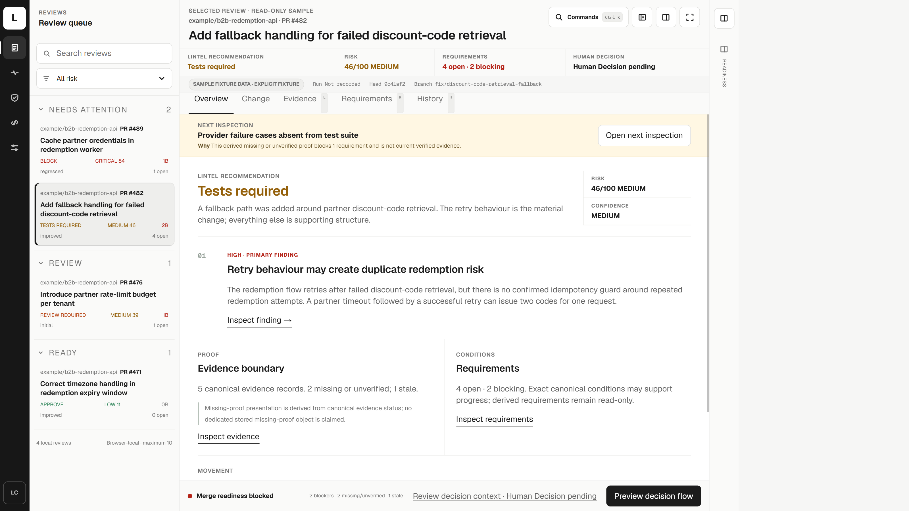
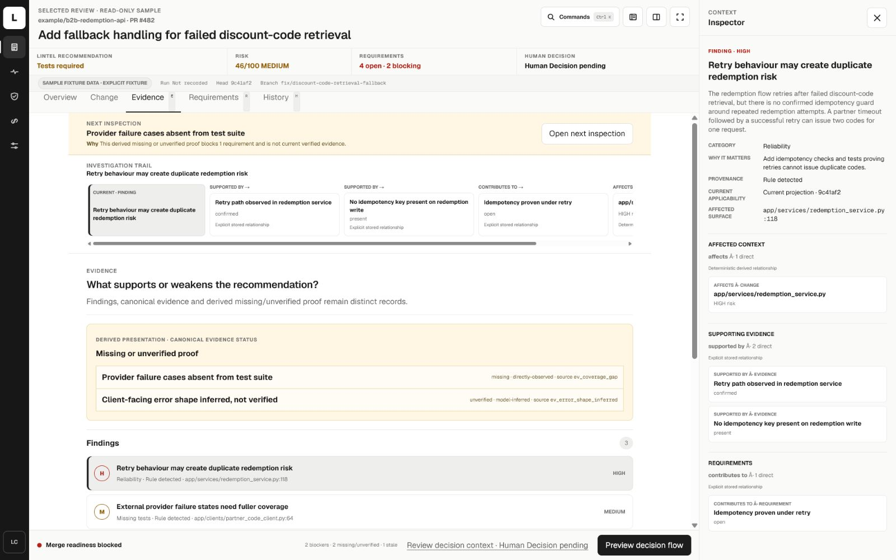
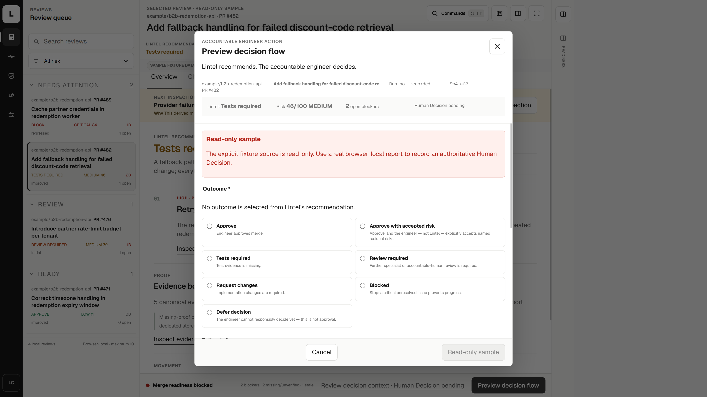

# Lintel

**Engineering verification for pull requests produced by engineers and coding agents.**

Lintel helps engineers determine whether a change is genuinely ready to merge. It connects code changes, findings, evidence, missing proof, explicit requirements, readiness and an accountable Human Decision.

> Agents create code. Lintel verifies what is ready.

Lintel is not a generic AI code review chatbot. It creates a structured verification record that helps a reviewer understand what is known, what remains uncertain and what must be resolved before a pull request can progress.



**The canonical sample keeps the pull request, risk, open proof, requirements and accountable decision in one verification surface.**



**Findings, provenance, missing proof and merge requirements remain connected and inspectable.**



**Lintel recommends. The accountable engineer decides.**

## Verification model

Lintel organises review information through:

**Change → Finding → Evidence → Missing proof → Requirement → Affected context → Readiness → Human Decision**

The recommendation is advisory. `APPROVE`, `REVIEW_REQUIRED` and `TESTS_REQUIRED` never become an implicit engineer decision.

The canonical product demonstration uses pull request `#482` in `example/b2b-redemption-api`:

| Field          | Value                                                    |
| -------------- | -------------------------------------------------------- |
| Title          | Add fallback handling for failed discount code retrieval |
| Recommendation | `TESTS_REQUIRED`                                         |
| Risk           | `46/100`, `MEDIUM`                                       |
| Requirements   | `4 open`, `2 blocking`                                   |
| Human Decision | `PENDING`                                                |

The sample intentionally remains unresolved so the evidence, missing proof and decision boundary stay truthful and repeatable.

## What is implemented

### Verification and analysis

* Deterministic analysis provides a reliable baseline for missing tests, retry and idempotency risks, provider failure handling, API contract concerns, logging and privacy issues, and unresolved requirements.
* Optional model assisted analysis is normalised into typed report structures, validated before use, and constrained by deterministic findings and fallback behaviour.
* Findings remain connected to evidence, provenance, uncertainty, missing proof and explicit requirements.
* Model derived output remains distinguishable from deterministic analysis.

### GitHub workflow

* GitHub App authentication with signed JWTs and short lived installation tokens.
* HMAC SHA256 webhook verification with timing safe comparison.
* Idempotent processing of supported installation, repository and pull request events.
* Automated pull request analysis and one persistent GitHub decision comment that can be updated by later analyses.
* Failure isolation that preserves the last valid review when later work fails.

### Reproducibility and review evolution

* Versioned canonical review manifests with source, commit identity, ruleset, generator and analysis provenance.
* Stable input, configuration and result fingerprints using deterministic serialisation.
* Server side replay verification for deterministic GitHub runs.
* Commit aware **Readiness Delta** across successful analyses.
* Deterministic **Review Diff** across findings, evidence, tests and readiness conditions.
* Failed analyses are excluded from valid comparison baselines.

### Agent Change Passport

Lintel can capture builder intent, producer identity, claimed tests, assumptions, constraints, known limitations and unresolved uncertainty from machine readable pull request content.

Declarations remain claims until independently supported by evidence. Lintel can distinguish declared information that is supported, unverified, or observed but undeclared.

### Decision support

* Explicit Human Decision authority.
* Local decision history and review history.
* Markdown and summary handoff.
* Recommendation and engineer authority remain separate throughout the product.

### Public product system

* Shared Next.js and TypeScript public shell across Product, How it works, Trust, Resources and curated documentation routes.
* Responsive, accessible interaction with keyboard support, reduced motion behaviour and deliberate product derived presentation.
* Shared navigation, grid, typography and editorial structure across the public product experience.
* Curated technical documentation and product truth surfaces that distinguish implemented behaviour, limitations and future work.

## Product surfaces

| Surface                     | Purpose                                                           |
| --------------------------- | ----------------------------------------------------------------- |
| `/workspace?source=fixture` | Canonical read only verification sample                           |
| `/new`                      | Create a review from a sample, public pull request or pasted diff |
| `/workspace`                | Main verification Workspace                                       |
| `/report`                   | Secondary Case File surface                                       |
| `/`                         | Public product overview                                           |
| `/product`                  | Product explanation                                               |
| `/how-it-works`             | Verification workflow                                             |
| `/trust`                    | Product truth, boundaries and limitations                         |
| `/resources`                | Curated resources and documentation                               |

The public product system is complete and frozen for the current milestone sequence. The next major programme is focused on the logged in application.

## Current work: R6 Workspace Experience

R6 is a controlled redesign and engineering migration of the logged in product. The goal is not to make the existing Workspace merely prettier. It is to turn Lintel into a calmer, faster and more deliberate **engineering verification workstation**.

The six part Cursor and Mobbin reference study, target application architecture and migration programme are complete. Implementation now begins with a private R6 interaction laboratory before production migration.

The reference study covered Agents, Cloud Agents, Bugbot, Integrations, Settings and Automations. It focused on spatial hierarchy, pane behaviour, progressive disclosure, object lifecycle, technical density, commands, responsive workstation states and interaction smoothness.

The central R6 principle is:

> **Show the engineer what matters for the job they are performing now, not everything the system knows at once.**

### Target R6 architecture

The authenticated application is being simplified around:

* **Reviews**, the default operating surface.
* **Policies**, for verification governance.
* **Integrations**, for external capability state and configuration.
* **Settings**, for data, model, storage, appearance and runtime behaviour.

The selected Review keeps five focused modes:

**Overview · Change · Evidence · Requirements · History**

### Planned workstation changes

R6 is designed to introduce:

* One coherent left application region with a collapsible, continuously resizable Review Queue.
* A contextual Inspector that opens only when selected evidence, requirements, findings, history or decision context needs additional space.
* Task specific Workspace geometry, including a wider Change mode for code and diff inspection.
* A global Commands layer for navigation and expert actions without permanent shortcut clutter.
* Per Review state restoration and responsive workstation behaviour for full screen use or companion use beside Cursor, Claude, Codex, terminals or documentation.
* A Human Decision draft model that remains local and explicitly unrecorded until persistence succeeds, and becomes stale if canonical verification changes.
* A restrained typography system using Geist Sans for interface language, Geist Mono for genuine technical identifiers, and tabular numerals for comparable engineering data.

The design principle is **dense locally, spacious globally**. Technical collections can remain compact while the overall workstation gives the active engineering task much more room.

### R6 delivery strategy

R6 is being delivered incrementally:

1. Freeze product truth, UI state ownership, fixtures and no regression contracts.
2. Build a private interactive visual laboratory before changing production Workspace composition.
3. Establish durable navigation, workspace state, action and typography foundations.
4. Migrate the production shell and Review modes incrementally.
5. Add Commands, keyboard behaviour, continuous resizing, responsive restoration and accessibility hardening.
6. Migrate Policies, Integrations and Settings into the accepted application system.
7. Complete performance, scale and adversarial validation before production cutover and removal of the obsolete shell.

The existing verification domain remains authoritative throughout migration. R6 moves existing product truth into a better workstation rather than rewriting the verification engine inside a new interface.

## AI assisted engineering workflow

I use specialised AI systems as constrained engineering collaborators.

**Claude** supports high judgement interface evaluation, spatial composition and comparison of bounded visual candidates.

**Codex** supports TypeScript implementation, state architecture, responsive behaviour, accessibility, testing, debugging and controlled migration.

I retain responsibility for product architecture, milestone scope, prompt constraints, acceptance criteria, semantic review, browser validation and merge approval.

Each milestone follows:

**Contract → implementation → automated validation → visual evidence → interaction evidence → adversarial review → accept or revise → freeze**

## Architecture

```text
Pull request or diff
        ↓
Deterministic analysis
        ↓
Optional model assisted synthesis
        ↓
Structured validation and guardrails
        ↓
Findings, evidence and missing proof
        ↓
Requirements and readiness
        ↓
Accountable Human Decision
```

### Security and trust boundaries

Credentials, installation tokens and webhook secrets stay outside browser state. Raw diffs, raw webhook payloads, authorisation headers and credentials are excluded from persisted review records.

Model assisted analysis may send submitted content to the configured provider. The repository does not claim that model assisted review is local or exactly reproducible.

The GitHub App path is a prototype using local filesystem persistence. Lintel does not claim a hosted production service, shared team database, paying customers or active production adoption.

## Technology

| Area                        | Technology                                    |
| --------------------------- | --------------------------------------------- |
| Application                 | Next.js App Router                            |
| Language                    | TypeScript                                    |
| Interface                   | React, CSS, CSS Modules                       |
| Typography                  | Geist Sans, Geist Mono                        |
| Model integration           | OpenAI Responses API                          |
| GitHub integration          | GitHub App authentication, REST API, webhooks |
| Local application state     | Browser storage                               |
| Prototype integration state | Local filesystem persistence                  |
| Package management          | npm                                           |

## Run the canonical sample locally

```bash
npm ci
npm run dev
```

Then open:

```text
http://localhost:3000/workspace?source=fixture
```

The fixture is read only. It does not make network requests, clear requirements or record a Human Decision.

Optional model and GitHub configuration is documented in `.env.example` and the repository documentation.

## Current limitations

* Lintel can miss or misclassify engineering risk.
* Reports support engineering judgement. They do not prove that a pull request is safe.
* Lintel does not replace tests, continuous integration, static analysis, security review or human code review.
* The GitHub App implementation is a prototype and currently uses local filesystem persistence.
* The repository does not claim hosted user accounts, shared team collaboration or active customer deployment.
* Model assisted analysis depends on the configured provider and may send submitted content outside the local application.
* R6 capabilities described above are current planned engineering work and should not be read as already shipped.

## What I designed and built

I designed and built Lintel as a long running product and engineering project spanning product architecture, frontend engineering, deterministic verification, model integration, GitHub security and automation, provenance, reproducibility, failure isolation, responsive interaction and accountable decision support.

The project demonstrates how I direct AI assisted engineering while retaining responsibility for architecture, product decisions, validation and integration.

## Further reading

* [Case study](docs/case-study.md)
* [Security model](docs/security-model.md)
* [Evaluation workflow](docs/evaluation.md)
* [Evaluation results](docs/evaluation-results.md)
* [Command line and GitHub Action blueprint](docs/cli-github-action-blueprint.md)

## Author

Built by [Denis Kapesa](https://github.com/dkapesa).

[LinkedIn](https://www.linkedin.com/in/denis-kapesa) · [GitHub](https://github.com/dkapesa)
